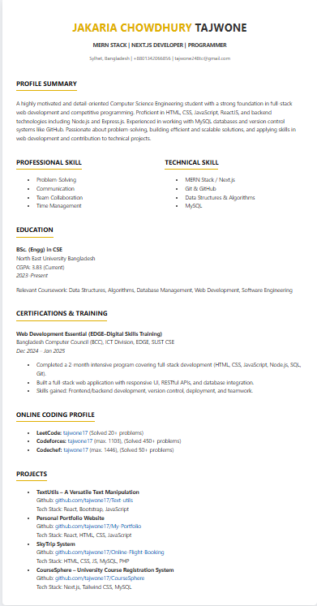

# My Resume - Jakaria Chowdhury Tajwone

A responsive and modern personal resume website built with HTML, CSS, and designed to showcase professional skills and experience.

## 🌐 Live Demo

**[View Live Resume](https://tajwone17.github.io/My-Resume/)**

## 🖼️ Preview



## 📋 About

This is a personal resume website for Jakaria Chowdhury Tajwone, featuring:

- Clean and professional design
- Responsive layout that works on all devices
- Modern styling with CSS
- Easy to customize and update

## 🛠️ Technologies Used

- **HTML5** - Markup structure
- **CSS3** - Styling and responsive design
- **Responsive Design** - Mobile-first approach

## 👨‍💻 Profile Highlights

- **Role**: MERN Stack | Next.js Developer | Programmer
- **Location**: Sylhet, Bangladesh
- **Skills**: Full-stack web development, competitive programming
- **Technical Stack**: MERN Stack, Next.js, MySQL, Git & GitHub

## 🚀 Features

- ✅ Responsive design for all screen sizes
- ✅ Clean and professional layout
- ✅ Easy to read typography
- ✅ Organized sections for skills, experience, and education
- ✅ Contact information readily available

## 📂 Project Structure

```
My Resume/
├── index.html          # Main HTML file
├── style.css           # CSS styles
├── README.md           # Project documentation
└── Screesnshot/
    └── image.png        # Screenshot of the resume
```

## 🔧 How to Use

1. Clone or download this repository
2. Open `index.html` in your web browser
3. The resume will display with all styling applied

## 📱 Responsive Design

The resume is fully responsive and adapts to:

- Desktop computers
- Tablets
- Mobile phones

## 📧 Contact Information

- **Email**: tajwone248tc@gmail.com
- **Phone**: +8801342066856
- **Location**: Sylhet, Bangladesh

## 📝 License

This project is open source and available under the [MIT License](LICENSE).

---

_Last updated: July 2025_
